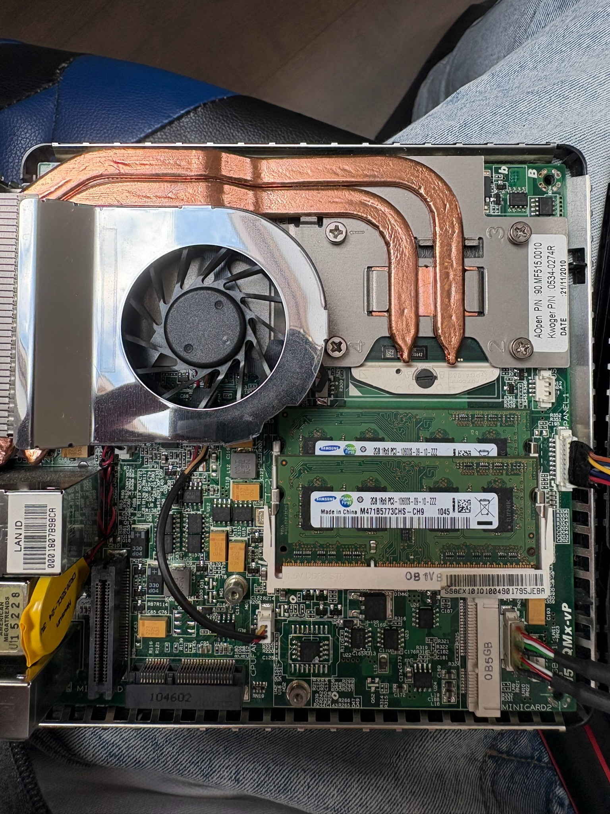

# Homelab Hardware

## Device

**Fujitsu Esprimo Q9000**

The device was prepared and upgraded before being put into service as the homelab server.

## Initial configuration

- RAM: 4 GB
- The original RAM configuration was replaced during the hardware upgrade.

## Hardware maintenance

The computer was physically cleaned before being deployed.

The cooling system was cleaned and the thermal paste was replaced.

## RAM upgrade

The original 4 GB RAM configuration was replaced with:

- 8 GB total RAM
- 2 × 4 GB Hynix modules
- The replacement modules use the same parameters as the original memory.

## Final role

After the hardware maintenance and upgrade, the Fujitsu Esprimo Q9000 was used as the homelab server running Debian Linux.

The system provides the foundation for the services and infrastructure documented in this repository.

## Maintenance photo

The following photo shows the device during hardware maintenance. The original 4 GB RAM modules are still installed at the time of the photo.

